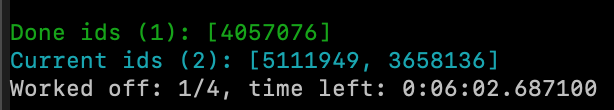

#Concerning the examples
APOLLO ships with a set of small examples including a data set of 4 red giants
from our calibration sample. These light curves were directly downloaded from the 
[KASOC website](http://kasoc.phys.au.dk/).

Magnitudes and temperatures for these stars were extracted from the Kepler
input catalogue.

While this set of examples should cover the basics on how to use the
pipeline, it doesn't show everything. Therefore, please also refer
to [parameters page](../parameters.md) and please read [input and output page](in_out_files.md)
before this.

Each example is build upon the previous, therefore it is advisable to work through these
one by one. 

#Example 1: Mini example
This example was already covered in the [first steps](first_steps.md) and 
consists of the minimal amount of settings. It runs the
pipeline on a single star and has the following config file (demo/1_mini_example.json):
```
{
  "General": {
    "Path for results": "demo_results/mini_example/",
  },
  "Analysis": {
    "Paths to lightcurves": "demo/data/",
    "Prefix of folder": "DEMO"
  },
  "List of IDs": "demo/sample_files/targets_single.txt"
}
```
and this sample file (```demo/sample_files/targets_single.txt```):
````
id T_eff mag
4057076 4708 11.844
```` 
It should produce the following output
```
-demo_results/
    -mini_example/
        -DEMO_4057076
            -result files
```
and produces the values of the resulting fit.

The interface for APOLLO usually looks like this:


and is split into three parts. At the top you can find the status 
of the stars currently running. 


At the furthest left you have two numbers: The first one is a simple _out of_,
the number on the right shows the number of currently running stars. Next to it,
you have the ID of the star, as defined in the sample file.Furthest to the 
right shows the log messages of the star, in this case the number of iterations in
DIAMONDS.

At the bottom of the interface you find the statistics for the whole run.


In green, it gives you the number of stars from the sample that are already
done, including the last couple of IDs in the brackets. Below that it shows
the currently running stars. On the bottom, in white, it how many stars are worked 
of from the total, as well as estimation of time that the run will still need.
This is computed by averaging over the run times from the result times the number of 
stars left, divided by the number of cores used. This is really a rough estimation
and will not be exact.

This example shows also the basic steps the code needs to take to complete:

- We start off by searching for the light curve. In principle, the file name of 
the light curve needs to contain the unique id somewhere in its name. APOLLO will 
find it automatically then.
- We load the light curve and reduces it, by applying sigma clipping and interpolation.
- We apply FliPer to find a guess for nu_max.
- We compute the centroids for all priors and compute their distributions.
- Sequentially, the oscillation model and prior model are applied to the data using 
DIAMONDS. 
After DIAMONDS completed its fit, we read out the estimated parameters and evidence.
- We build up the results file and the result file.

After running this example end the code and check the result files.

# Example 2: More settings & Plots

In this example, lets look at a settings file that contains probably most parameters
that are set in a standard usage of APOLLO. It consists of the following 
config file (demo/2_default_parameters.json) and is probably a good copy-paste template:
```
{
  "General": {
    "Path for results": "demo_results/mini_example/",
    "Number of cores used": 2,
    "Check Bayes factor after run": true,
    "Force run": false
  },
  "Analysis": {
    "Paths to lightcurves": "demo/data/",
    "Prefix of folder": "DEMO"
  },
  "Plot": {
    "Save plots": true
  },
  "List of IDs": "demo/sample_files/targets_single.txt"
}
```
Lets go through the added settings one by one:

- ```Number of cores used```: By default APOLLO applies multi processing. It assigns
each star one core of your processor, until all cores are in use. Then, after a star 
is finished, the next star in line gets this core assigned. APOLLO can be computationally
quite demanding, and filling up all your cores on your machine will influence other 
things you might want to do, while APOLLO is running. With this setting you can restrict
the number of cores APOLLO uses. If the value you set here exceeds the number of cores
on your system, it will automatically restrict it to the maximum available.
- ```Check Bayes factor after run```: Due to the fact, that DIAMONDS is a probabilistic code,
one run might not yield the exact result as another one for the same star. These 
deviations are usually very small and don't influence the result. If you apply APOLLO
to a noisy or short light curve though, It might be useful to rerun DIAMONDS if the Bayes factor 
doesn't show strong evidence, that the oscillation model is more favourable than the noise model. If this 
setting is ```true```, it will do exactly that, up to three times. In general, it is useful to keep this setting to true.
- ```Force run```: If you run a large sample of stars, you might want to stop APOLLO for some reason, and continue
later on without recomputing the whole set of already computed results. APOLLO solves this problem, by checking if a
result file is available for a given star. If so, it will stop the run for the star and continue with the next one.
If you set this setting to ```true```, this behaviour will be overruled, and even already computed results will be 
redone.  
- ```Save plots```: APOLLO has the possibility to create a large array of automated plots, to understand whats going on
inside the code. We will go through those plots below. This setting allows you to save those plots automatically in the
result folder of a given star. 

The plots of APOLLO are always automatically created. Now, if something goes wrong or a result is not really what you 
expect, or you might just want to look at the fitted PSD, you can do that. Lets look at what 
APOLLO produces for this example, in order when they are produced:

**Lightcurve_sigma_clipping:**

The large frame shows the light curve of the star. As you can see, APOLLO also 
sets the firs observation point to zero and removes the mean of the light curve. The 
smaller plot then shows the distribution of flux values for the star. This distribution is represented through 
a normal distribution (blue line) and all values outside of 4 sigma are discarded (black dashed lines). In this case,
no values are outside of 4 sigma.
**Lightcurve_interpolation:**

This shows the interpolation done by APOLLO. Gaps larger than three days are approximated by a simple linear connection
between the two adjacent points of the gap (represented here in red).y
**PSD_guess_full_fit:**

This plot shows you what the background fit would look like, if the estimated centroid values for the priors would 
be correct. In red you can see the total oscillation model fit, the dashed blue lines are the Harvey-like functions,
in cyan the power excess, the yellow dotted line represents the white noise and the green line a heavily smoothed 
version of the PSD.
**PSD_full_fit:**

This is the result form the oscillation model fit from DIAMONDS. Individual lines have the same meaning as for the 
PSD_guess_full_fit.
**PSD_noise_fit:**

This shows the resulting fit for the noise model from DIAMONDS. Again, the individual functions have the same meaning
as above. In this case, clearly the oscillation model produces a better result.
**Marginal_distibution_n=10/7:**
 
These are the two marginal distributions provided by DIAMONDS for both models. It is advisable to check these, if 
something goes wrong
**Parameter_trend_n=10/7:**
 
These plots show the parameter progression of the individual free parameters of the model. Again, these plots are 
useful if some problem occurs and you can check how the parameters converge.
**Oscillation_region**:

Here you can see a zome in of the oscillation region determined through the oscillation model. The violet dashed line
is nu_max as determined from DIAMONDS.
**ACF_Delta_nu,ACF_fit_delta_nu**
 
These plots show the autocorrelated oscillation region, slightly smoothed. The red dashed line is the estimation of
delta nu through scaling relations, the red line shows the fit at that point, and the blue dashed line shows the true
value of delta nu.

The resulting values should be very simar for this example as they are for example 1, as we still are using only one
star. Lets look how the pipeline performs with multiple targets.

# Example 3: Unleash parallelism
APOLLO was developed with modern multi-core systems in mind. Lets look at the config file,
if we want to run multiple stars (demo/2_multiple_stars_parallel.json):
```
{
  "General": {
    "Path for results": "demo_results/3_multiple_stars_parallel/",
    "Number of cores used": 2,
    "Check Bayes factor after run": true,
    "Force run": false
  },
  "Analysis": {
    "Paths to lightcurves": "demo/data/",
    "Prefix of folder": "DEMO"
  },
  "Plot": {
    "Save plots": true
  },
  "List of IDs": "demo/sample_files/targets_multiple.txt"
}
```
There is only one change to example 1 and 2! We switched out the sample list file 
under ```List of IDs```. APOLLO runs stars in parallel by default, no special setting is
needed. In fact it is the other way round: If you want to run stars sequentially, you need to set 
```"Sequential run" : true```. In this case, we only want to occupy 2 cores on our system, therefore the setting 
for it is set to 2. If you run the example, you get the following screen:

So, these two stars will be completed independently and in parallel. Below you can 
see the statistics of the total run at the start:

And after a while this will change to

and finally 


So, applying multiprocessing with APOLLO is quite easy!

# Example 4: Automated repeating of runs
Generally, it is advisable to run APOLLO multiple times for a given star and average
the result. APOLLO can do this automatically for you. Consider this config file 
(demo/4_repeating_of_runs.json):
```
{
  "General": {
    "Path for results": "demo_results/4_repeating_of_runs/",
    "Number of cores used": 32,
    "Check Bayes factor after run": true,
    "Force run": false
  },
  "Analysis": {
    "Paths to lightcurves": "demo/data/",
    "Prefix of folder": "DEMO",
    "Number of repeats": 3
  },
  "Plot": {
    "Save plots": true
  },
  "List of IDs": "demo/sample_files/targets_single.txt"
}
```
We added the option ```Number of repeats```. The value set for this setting defines 
how often APOLLO runs a given star. This is done, by simply creating multiple instances
of one run. The order of runs won't be in order for a given star, but rather APOLLO
will generate multiple results for one star. This is also shown in the interface:

APOLLO adds the run number to the run of a star, which is also reflected in the 
folder structure:
```
-4_repeating_of_runs/
    -DEMO_id
        -run_1_id/
        -run_2_id/
        .
        .
        .
```
where the ```run_n``` folder contain the results for one run, similar to the other examples.

